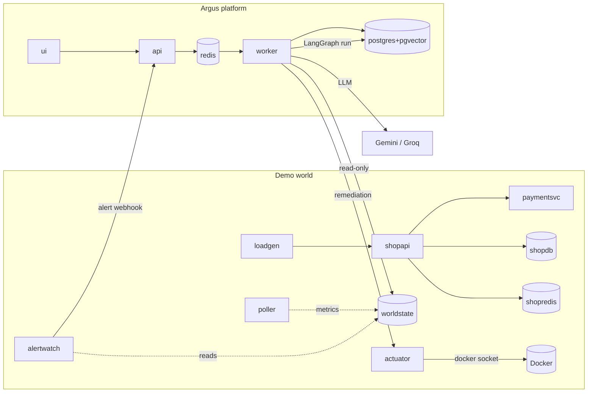

# Argus — an AI on-call engineer

Argus is a **multi-agent incident-response platform**. When an alert fires on a running
system, Argus investigates it the way a human SRE would — reads logs, checks metrics,
reviews recent deploys — forms a root-cause hypothesis, has that hypothesis **independently
reviewed**, and then either fixes the problem itself or **pauses for human approval**,
depending on risk and confidence. Every step is traced end to end. Every resolved incident
becomes a **memory** that makes the next similar incident faster and cheaper. An
**evaluation harness** proves the whole thing with numbers.

It is not a chatbot wrapper. It is production-shaped infrastructure for autonomous AI
workflows: task decomposition, tool use, independent review, deterministic safety gating,
human-in-the-loop, persistent memory, full observability, and a measurable eval suite.

> **Stack:** LangGraph · FastAPI · Celery · Postgres/pgvector · React/TS · OpenTelemetry ·
> Docker Compose · Gemini + Groq (free tiers). Runs offline except for the LLM API calls.

_(Demo GIF placeholder — see `docs/img/` and the recording checklist in
[INTERVIEW_NOTES.md](INTERVIEW_NOTES.md).)_

## Architecture

Two systems ship in one `docker-compose.yml`: a **demo world** (the patient — a small
e-commerce stack that emits real logs/metrics/deploys and can be broken 5 ways) and the
**Argus platform** (the doctor — the agent system that investigates and remediates).



**The incident loop:** alertwatch fires a webhook → the API creates an incident and
enqueues a Celery task → the worker runs a LangGraph graph (`intake → recall → plan →
parallel specialists → synthesize → review → risk gate → remediate/approve → verify →
postmortem`) with a Postgres checkpointer keyed on the incident id → a deterministic risk
gate decides autonomous vs. human approval → on approval the graph resumes from the exact
paused node → recovery is verified from raw metrics → a postmortem memory is written.

## Why this is interesting

The five things AI-engineering roles actually screen for, each mapped to code:

| Claim | Where it lives |
|---|---|
| **Multi-agent orchestration** — supervisor plans, specialists execute in parallel, a reviewer validates; a LangGraph state machine, not a prompt chain | [`graph/build.py`](src/argus/graph/build.py), [`graph/fanout.py`](src/argus/graph/fanout.py), [`agents/`](src/argus/agents) |
| **Safety architecture** — the LLM never authorizes its own risky action; a deterministic policy gate does, and the tool executor refuses mutations outside the `remediate` node | [`policy/risk_gate.py`](src/argus/policy/risk_gate.py), [`tools/registry.py`](src/argus/tools/registry.py), [`config/policy.yaml`](config/policy.yaml) |
| **Human-in-the-loop** — real `interrupt()`/resume across a worker restart; approve / modify / reject / take-over | [`graph/nodes/`](src/argus/graph/nodes), [`api/routers/approvals.py`](src/argus/api/routers/approvals.py) |
| **Memory that provably helps** — pgvector recall + postmortem writes + a similarity fast-path, measured by an on/off ablation | [`memory/recall.py`](src/argus/memory/recall.py), [`memory/pgvector_store.py`](src/argus/memory/pgvector_store.py) |
| **Evaluation discipline** — a 15-case seeded-fault suite with deterministic ground truth + an auditable LLM judge; recovery is re-derived from raw metrics (the system never grades its own homework) | [`evals/run.py`](src/argus/evals/run.py), [`evals/grade.py`](src/argus/evals/grade.py), [EVALUATION.md](EVALUATION.md) |
| **Observability** — one OTel instrumentation, two sinks (Postgres for the UI, optional Jaeger); trace trees down to individual prompts, tokens, and dollars | [`obs/spans.py`](src/argus/obs/spans.py), [`obs/otel.py`](src/argus/obs/otel.py) |

## Evaluation

Argus grades itself on 15 seeded-fault cases (S1–S5 × three variants: clean / decoy
deploys / noisy) across **RCA accuracy, remediation correctness, recovery rate, escalation
precision & recall, MTTR, and cost**, plus two ablations (memory on/off, supervisor-model
A/B). Grading is mostly deterministic — recovery is re-derived from raw `metrics.jsonl`,
escalation from the approvals row, remediation from the actuator history; only root-cause
_phrasing_ is judged, with an auditable rubric and a keyword fallback. Full method + scores
live in **[EVALUATION.md](EVALUATION.md)**.

> **Headline-numbers status:** the harness is complete and validated end-to-end (a live
> `S3-v1` run grades **PASS** on all four checks; M07 measured a **54 % memory-lift** on
> repeats). The committed full-suite run is **quota-degraded** — both free-tier LLM
> providers exhausted mid-run — so a clean headline + ablation re-run is queued for fresh
> quota and will regenerate EVALUATION.md. See its top-of-file caveat.

## Quickstart

Needs only **Docker + git** (the services run in containers). Two free API keys, no card:
[Gemini](https://aistudio.google.com) · [Groq](https://console.groq.com).

```bash
git clone https://github.com/Meetbarasara/argus && cd argus
cp .env.example .env            # then paste your GOOGLE_API_KEY + GROQ_API_KEY
docker compose --profile platform --profile world up -d --build
# break the world and watch Argus respond:
docker compose exec actuator python -m demoworld.inject --scenario S1
open http://localhost:8081       # incidents · trace explorer · approvals · memory · dashboard
```

For the narrated 5-minute storyline (inject S3 → approve → resolve → repeat-fault memory
win, with a before/after comparison), run the guided demo from the host (needs `uv`):

```bash
uv run python -m argus.demo            # interactive: approve in the UI when prompted
uv run python -m argus.demo --auto     # unattended (policy_sim approvals) — recording-safe
```

> Live-audience insurance (ADR-05): do a `--llm-mode record` dry run first, then present
> against `--llm-mode replay` for a deterministic, zero-quota walkthrough.

## Repo tour

```
src/argus/        platform: api/ worker/ graph/ agents/ llm/ tools/ memory/ policy/ obs/ db/ repo/ evals/
src/demoworld/    the monitored world: shopapi, paymentsvc, loadgen, poller, alertwatch, actuator, inject
ui/               Vite + React + TS + Tailwind — 5-page control room
config/           models.yaml · policy.yaml · alert_rules.yaml · prices.yaml
evals/scenarios/  S1-v1.yaml … S5-v3.yaml (the versioned 15-case suite)
plan/             the pre-approved build plan (source of truth) + PROGRESS.md
tests/            unit/ · graph/ · integration/ · world (markers in plan/05)
```

Run the checks: `uv run poe verify` (ruff + mypy + unit) · `uv run poe test-graph`
(LangGraph tier) · `uv run poe verify-all` (+ integration + world in a container).

## Architecture decisions

One-liners; rationale in [plan/02-architecture.md](plan/02-architecture.md).

- **ADR-01** — pgvector, not a dedicated vector DB (memory is <100k vectors; one less service; swappable behind a `VectorStore` interface).
- **ADR-02** — deploys are hot-reloaded config files, not container restarts (deterministic, instant, clean audit trail for the change-analyst).
- **ADR-03** — the actuator is the single privileged choke point (only it holds the docker socket; agents get *capabilities*, not *credentials*).
- **ADR-04** — the risk gate is deterministic code, not an LLM (the LLM proposes; `policy.yaml` disposes).
- **ADR-05** — record/replay is built into the LLM layer (deterministic tests + demos, zero quota).
- **ADR-06** — the graph runs synchronously inside Celery (boring, reliable; parallelism via LangGraph's Send API, not asyncio).
- **ADR-07** — one instrumentation, two span sinks (Postgres for the UI + optional OTLP → Jaeger).
- **ADR-08** — the UI polls; no websockets (incidents last minutes; removes a failure class).
- **ADR-09** — world telemetry is JSONL files, not Prometheus/Loki (deterministic, seedable; the *platform's* own telemetry is the full-featured part).
- **ADR-10** — local embeddings via fastembed (bge-small, ONNX, baked into the image; no API, no rate limits).

## Limitations (honest scope)

Deliberately **out of scope** (single-operator portfolio project): no auth / multi-tenancy;
docker-compose only (no Kubernetes); no real PagerDuty/Slack integrations (the webhook + UI
stand in); polling, not token streaming; no fine-tuning; services run in containers only
(no Windows-native); the demo world stays small (2 app services + 2 datastores).

Known **evaluation** limitations are analyzed, not hidden, in
[EVALUATION.md](EVALUATION.md) §Failures — including change-correlation precision under
decoy deploys, and the free-tier quota ceiling that caps a full unattended suite run.

## License

[MIT](LICENSE).
