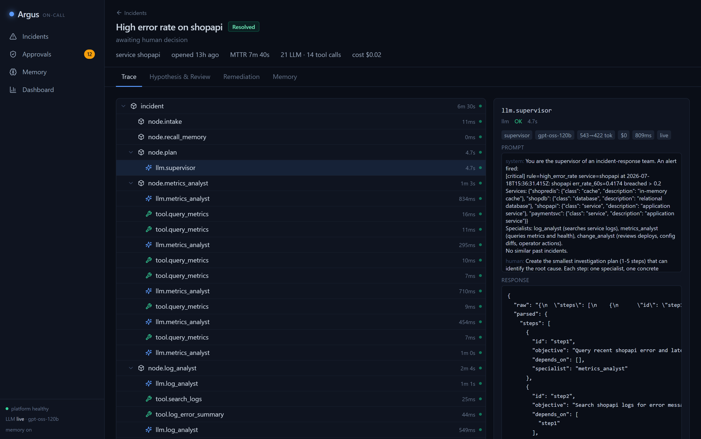
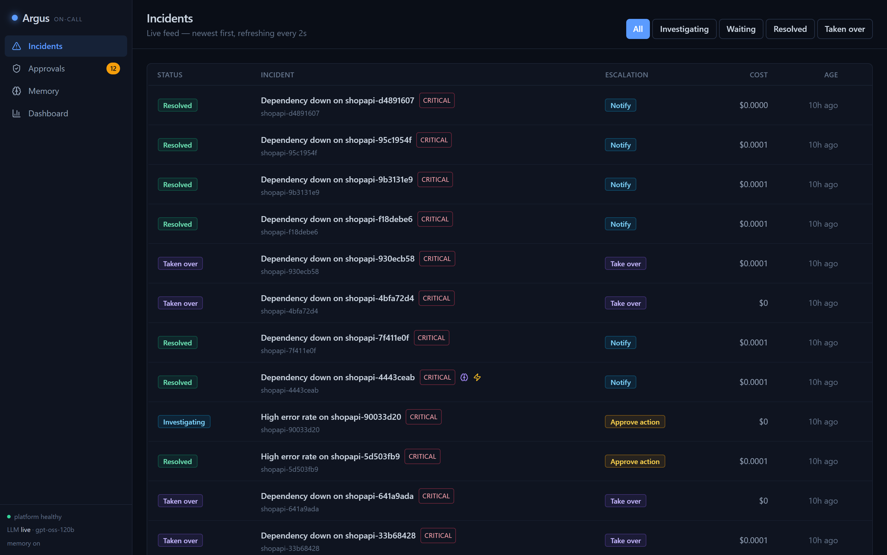
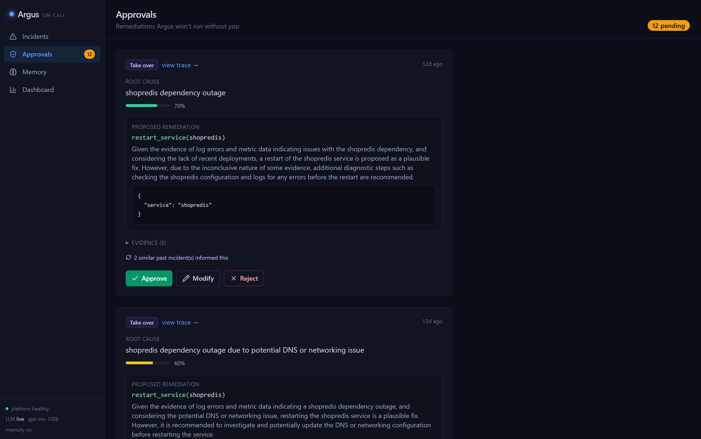
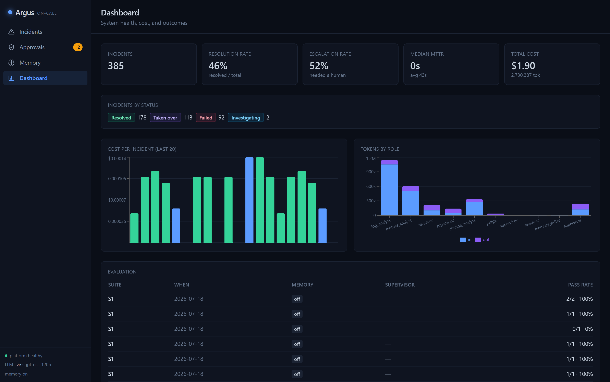
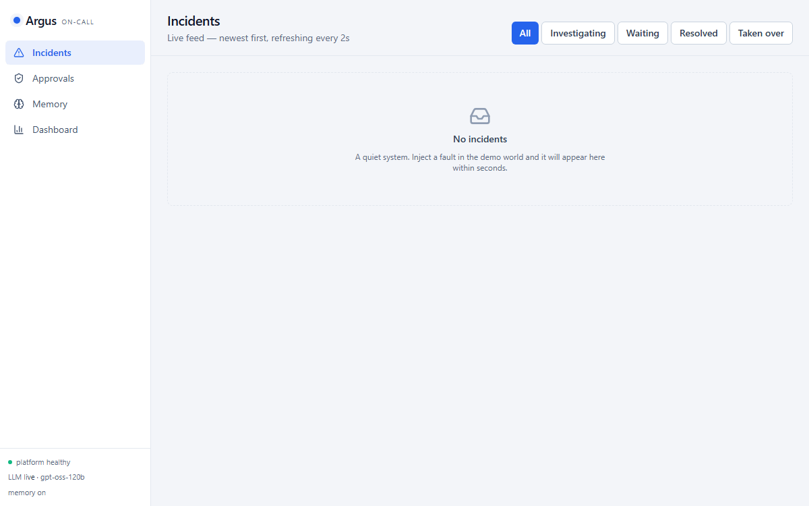
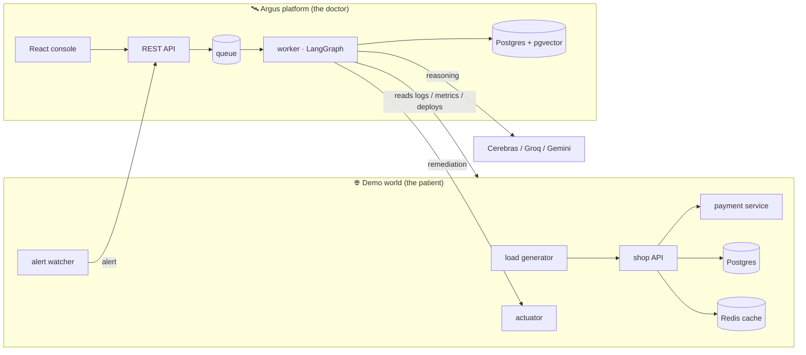

<div align="center">

# 🛰️ Argus

### An AI on-call engineer — it investigates production alerts, finds the root cause, and safely fixes it or escalates to a human.

[](LICENSE)
[](https://www.python.org)
[](https://langchain-ai.github.io/langgraph/)
[](https://fastapi.tiangolo.com)
[](https://react.dev)
[](https://github.com/pgvector/pgvector)
[](https://docs.docker.com/compose/)

</div>

When an alert fires, **Argus does what a seasoned SRE does**: it reads the logs, checks the
metrics, reviews recent deploys, forms a root-cause hypothesis, has that hypothesis
**independently reviewed**, and then — depending on risk and confidence — either **fixes the
problem itself** or **pauses and asks a human to approve**. The decision to act is made by a
deterministic policy, *never* by the language model. Every step is traced down to the
individual prompt, token, and dollar. Every resolved incident becomes a **memory** that makes
the next similar incident faster and cheaper.

It ships with its own **live demo world** — a small e-commerce stack you can break in five
realistic ways — so you can watch the whole investigate → approve → remediate → learn loop
end to end, on your laptop, in minutes.

<div align="center">


<br/><em>A real resolved incident, opened as a trace — every LLM span drills down to its exact prompt, tokens, and cost.</em>

<table>
<tr>
<td align="center"><br/><sub><b>Live incident feed</b> — status, escalation, cost</sub></td>
<td align="center"><br/><sub><b>Approval card</b> — approve / modify / reject</sub></td>
<td align="center"><br/><sub><b>Dashboard</b> — outcomes, cost, tokens by role</sub></td>
</tr>
</table>

<!--  -->
</div>

---

## ✨ Features

- 🤖 **Multi-agent investigation** — a *supervisor* plans the investigation, *specialist*
  agents gather evidence in parallel using real tools (log search, metric queries, deploy
  history), and a *reviewer* independently validates the hypothesis. It's a stateful graph,
  not a linear prompt chain.
- 🛡️ **Safety by construction** — the LLM only *proposes* a fix; a deterministic risk policy
  *disposes*. Anything risky requires human approval, and destructive actions are locked to a
  single node behind a privileged, token-authenticated actuator.
- 🙋 **Human-in-the-loop** — high-risk incidents pause for a human with the full context
  (evidence, reasoning, proposed action). The paused investigation is durable — it survives a
  restart and resumes from the exact step on **approve / modify / reject**.
- 🧠 **Memory that compounds** — every resolved incident is distilled into a vector memory.
  When a similar fault recurs, Argus recalls the past fix and resolves it in fewer steps.
- 🔭 **Full observability** — one OpenTelemetry instrumentation feeds both a queryable
  Postgres store (powering the UI) and an optional Jaeger view. Open any incident as a trace
  tree, drill into a span, and see the exact prompt, token counts, and cost.
- 🖥️ **Operator console** — a React UI: live incident feed, an interactive trace explorer,
  approval cards, a memory browser, and cost/outcome dashboards.
- 📊 **Measured, not vibes** — a 15-case seeded-fault evaluation suite scores root-cause
  accuracy, remediation correctness, recovery rate, escalation precision/recall, and cost —
  with **ablations** (memory on/off, model A/B).

---

## 🏗️ How it works



**The incident loop:** an alert becomes an incident → the graph runs
`plan → investigate (parallel specialists) → synthesize → review → risk gate → remediate or
request approval → verify recovery → write postmortem memory`, checkpointed at every step so
it can pause for a human and resume later.

---

## 🧰 Tech stack — and *why*

Every choice here is deliberate and defensible:

| Concern | Technology | Why this one |
|---|---|---|
| **Agent orchestration** | **LangGraph** | Incidents are stateful, multi-step workflows with branching, retries, and human pauses. A graph with a durable checkpointer models that natively — a prompt chain can't pause, resume, or fan out to parallel workers. |
| **API layer** | **FastAPI** | Async REST with Pydantic validation at the boundary and automatic OpenAPI docs. |
| **Background execution** | **Celery + Redis** | A graph run takes minutes and must survive process restarts, so it runs on a durable task queue — not a request thread. Redis also backs the LLM rate limiter. |
| **Data + memory** | **PostgreSQL + pgvector** | *One* database for both relational data (incidents, spans, approvals) and vector memory. No separate vector service to run, secure, or pay for — and it's swappable behind a thin interface. |
| **Embeddings** | **fastembed** (bge-small, ONNX) | Local embeddings baked into the image — no embedding API, no rate limits, fully offline. |
| **Language models** | **Cerebras + Groq + Gemini** | A provider-agnostic router with record/replay caching and automatic fallback; swapping any role's model is one environment variable. High-volume roles run on Cerebras/Groq (generous free budgets); Gemini serves only the low-volume eval judge. Runs entirely on free tiers. |
| **Observability** | **OpenTelemetry** | Instrument once, export twice — to Postgres (powers our UI/dashboards) and optionally to Jaeger. Industry-standard trace trees, right down to prompt/token/cost. |
| **Frontend** | **React + TypeScript + Tailwind + Vite** | A typed, responsive operator console; TanStack Query polling keeps it simple (incidents last minutes, so no websockets needed). |
| **Deployment** | **Docker Compose** | The entire system — platform *and* a live demo world — boots with a single command, reproducibly, on any machine with Docker. |
| **Dev toolchain** | **uv · Ruff · Mypy · Pytest** | Fast, strict, fully typed — with unit, integration, and graph test tiers. |

---

## 🚀 Getting started

### Prerequisites

- **Docker + Docker Compose** and **git**. That's it — every service runs in a container.
- Three **free** LLM API keys (no credit card): [Cerebras](https://cloud.cerebras.ai),
  [Groq](https://console.groq.com), and [Google AI Studio](https://aistudio.google.com) (Gemini).

### 1 · Clone and configure

```bash
git clone https://github.com/Meetbarasara/argus.git
cd argus
cp .env.example .env         # then paste your GOOGLE_API_KEY and GROQ_API_KEY
```

### 2 · Launch the whole system

```bash
docker compose --profile platform --profile world up -d --build
```

This starts the Argus platform **and** the live demo world. Open the console at
**http://localhost:8081** — you'll see a quiet, healthy system.

### 3 · Break something and watch Argus respond

```bash
docker compose exec actuator python -m demoworld.inject --scenario S1
```

Within seconds an incident appears in the UI as `INVESTIGATING`; the trace tree grows live as
the agents work; Argus diagnoses the stopped cache, restarts it, verifies recovery, and writes
a memory — all on its own (S1 is low-risk, so it acts autonomously and just notifies you).

### ▶️ The guided 5-minute demo

For the full narrated storyline — a risky bad-deploy that pauses for your approval, then the
*same* fault a second time resolving faster thanks to memory — run:

```bash
uv run python -m argus.demo          # interactive: approve in the UI when prompted
uv run python -m argus.demo --auto   # hands-free (auto-approves) — great for recording
```

### The five fault scenarios

Each one is a reproducible fault with a known correct fix — this is what "working" means:

| Scenario | What breaks | Argus's fix | Human approval? |
|---|---|---|---|
| **S1** `redis_down` | cache container stopped | restart the cache | auto (just notifies) |
| **S2** `payment_latency` | payment service slows down — *with no deploy to blame* | restart the service | ✅ approve |
| **S3** `bad_deploy` | a deploy points checkout at a dead payment URL | roll back that deploy | ✅ approve |
| **S4** `db_pool_exhaustion` | a deploy shrinks the DB connection pool | roll back that deploy | ✅ approve |
| **S5** `feature_flag_500` | a deploy enables a broken feature flag | roll back that deploy | ✅ approve |

> S2 is the interesting one — there's no recent deploy, so an agent that blindly blames the
> last change gets it wrong. Argus doesn't.

---

## 🛡️ The safety model

Argus is built so a language model can never authorize its own risky action. Three independent
layers stand between a hypothesis and a production change:

1. **Independent review** — a separate reviewer agent must accept the hypothesis before it can
   proceed; weak evidence loops back for revision, then escalates.
2. **A deterministic risk gate** — plain code (not an LLM) maps *(action × target × confidence)*
   to an escalation level. The model proposes; policy disposes.
3. **Human-in-the-loop** — anything above "notify" pauses for a human, who sees the full
   evidence and approves, modifies, or rejects. Approval resumes the exact paused step.

Plus **capability isolation**: only the privileged actuator can touch infrastructure, behind a
token that never appears in a log or a prompt — agents get *capabilities*, not *credentials*.

---

## 📁 Project structure

```
src/argus/        The platform — api · worker · graph · agents · llm · tools · memory · policy · obs · evals
src/demoworld/    The monitored world — shop & payment services, load generator, alerting, fault injector
ui/               React + TypeScript operator console (5 pages)
config/           Model routing, risk policy, alert rules, pricing (all YAML)
evals/scenarios/  The versioned 15-case evaluation suite
```

Run the checks locally: `uv run poe verify` (lint + types + unit tests) or
`uv run poe verify-all` (adds the integration + world tiers).

---

## 📊 Evaluation

Argus grades itself on 15 seeded-fault cases (the five scenarios above × three variants:
clean, decoy-deploys, and noisy) across **root-cause accuracy, remediation correctness,
recovery rate, escalation precision & recall, MTTR, and cost** — plus two ablations
(**memory on/off** and a **supervisor-model A/B**). Grading is mostly deterministic: recovery
is re-derived from raw metrics, so the system never grades its own homework; only root-cause
*phrasing* is judged, with an auditable rubric. Method and scores live in
**[EVALUATION.md](EVALUATION.md)**.

---

## 🗺️ Scope

Argus is a focused, single-operator system — deliberately **not** trying to be a cloud product.
Out of scope by design: authentication/multi-tenancy, Kubernetes (Compose only), real
PagerDuty/Slack integrations (the webhook + UI stand in), token streaming, and fine-tuning. The
demo world stays intentionally small (two app services + two datastores) so the *platform* is
where the engineering goes.

---

## 📄 License

Released under the [MIT License](LICENSE).
