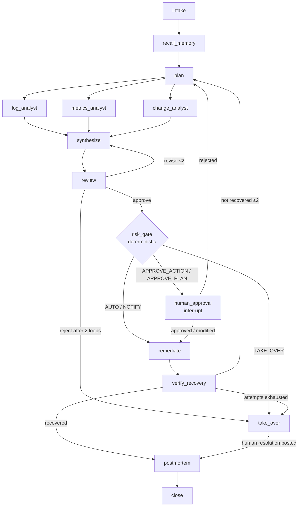

# 04 — Agents, Graph, Schemas, Prompts, Tools

> Single source of truth for the LangGraph topology, agent contracts, structured
> schemas, and the tool registry. Milestones cite this; nothing redefines it.

## 1. Graph topology



M05 runs D1–D3 **sequentially** (simple edge chain); M08 switches to parallel fan-out
with LangGraph's Send API and a joining reducer. Everything else is identical.

### Node table

| Node | Type | Reads → writes (state keys) | Notes |
|---|---|---|---|
| intake | deterministic | alert → incident_ctx, budget | sets status INVESTIGATING; builds service catalog snapshot |
| recall_memory | deterministic (+embed) | alert → memory_hits, fast_path_hint | skipped when MEMORY_ENABLED=false (still writes empty list) |
| plan | LLM supervisor | alert, memory_hits → plan | structured `InvestigationPlan` |
| log_analyst / metrics_analyst / change_analyst | LLM specialist tool-loop | plan step → findings[] | each executes only its assigned steps |
| synthesize | LLM supervisor | findings, memory_hits → hypothesis | includes proposed `RemediationAction` from the remediation catalog |
| review | LLM reviewer | hypothesis, findings → review (verdict) | different provider than specialists |
| risk_gate | **deterministic** | hypothesis → escalation decision | policy.yaml; emits `policy` span with rule trace |
| human_approval | interrupt | escalation → approval decision | creates approvals row; graph suspends |
| remediate | deterministic executor | action → remediation_attempts[] | calls mutating tools; only node allowed to |
| verify_recovery | deterministic | alert rule → recovery result | re-evaluates the breached rule; 2 consecutive OK checks within 120s |
| postmortem | LLM memory_writer | full state → memory row + summary | also final incident update |
| take_over | interrupt | full state → human resolution | packages context; waits for takeover_resolution |
| close | deterministic | — | terminal bookkeeping |

### Edge conditions & loop budgets (from policy.yaml limits)

| From → to | Condition |
|---|---|
| review → synthesize | verdict = revise AND review_loops < 2 (feedback appended to prompt) |
| review → take_over | verdict = reject AND review_loops ≥ 2 |
| risk_gate → remediate | level ∈ {AUTO, NOTIFY} (NOTIFY also inserts an `AUTO` approvals row as the info feed) |
| risk_gate → human_approval | level ∈ {APPROVE_ACTION, APPROVE_PLAN} |
| human_approval → remediate | decision ∈ {approve, modify} (modified action already re-gated by the API) |
| human_approval → plan | decision = reject (reviewer feedback = human comment; replan counts as remediation attempt) |
| verify_recovery → plan | not recovered AND remediation_attempts < 2 (failed attempt becomes evidence) |
| verify_recovery → take_over | attempts exhausted |
| any LLM node → take_over | budget breach: llm_calls_used ≥ 40 OR wall clock ≥ 420s (checked in a pre-node guard) |
| specialist internal | tool-loop: on tool error → 1 retry with the error text; a failed step yields a Finding with `confidence: 0.0` and the failure noted — synthesize plans around it |

## 2. Graph state

```python
class IncidentState(TypedDict):
    incident_id: str
    alert: dict                      # payload from 03 §2
    service_catalog: dict            # {service: {class, description}} from policy.yaml target_classes
    memory_hits: list[MemoryHit]     # [{memory_id, title, content, similarity, kind}]
    fast_path_hint: NotRequired[dict]  # {memory_id, previous_remediation, similarity}
    plan: NotRequired[InvestigationPlan]
    findings: Annotated[list[Finding], operator.add]   # append reducer (parallel-safe)
    hypothesis: NotRequired[Hypothesis]
    review_history: Annotated[list[ReviewVerdict], operator.add]
    escalation: NotRequired[dict]    # {level, rule_trace, approval_id}
    approval_decision: NotRequired[dict]  # resume payload
    remediation_attempts: Annotated[list[dict], operator.add]  # {action, result, ts}
    recovery: NotRequired[dict]      # {recovered: bool, checks: [...]}
    budget: dict                     # {llm_calls_used, started_at_iso}
    status_reason: NotRequired[str]
```

Persistence: LangGraph PostgresSaver checkpointer, `thread_id = incident_id`. The
`incidents` table mirrors user-facing fields (status, counters) — updated by nodes via
a small `incident_repo`, never by the UI.

## 3. Structured output schemas (Pydantic v2 — `argus/agents/schemas.py`)

```python
class PlanStep(BaseModel):
    id: str                                   # "step-1"
    specialist: Literal["log_analyst", "metrics_analyst", "change_analyst"]
    objective: str                            # one question to answer
    depends_on: list[str] = []

class InvestigationPlan(BaseModel):
    steps: list[PlanStep] = Field(min_length=1, max_length=5)
    rationale: str

class Evidence(BaseModel):
    kind: Literal["log", "metric", "deploy", "action", "memory"]
    ref: str                                  # e.g. "logs/shopapi.jsonl@2026-07-05T10:31Z" or "d-0042"
    excerpt: str = Field(max_length=500)

class Finding(BaseModel):
    step_id: str
    specialist: str
    summary: str
    evidence: list[Evidence] = Field(max_length=6)
    confidence: float = Field(ge=0, le=1)

class RemediationAction(BaseModel):
    tool: Literal["restart_service", "rollback_deploy"]   # the remediation catalog
    params: dict                              # validated against the tool's arg schema
    target_service: str
    rationale: str

class Hypothesis(BaseModel):
    root_cause: str
    affected_services: list[str]
    confidence: float = Field(ge=0, le=1)
    supporting_evidence: list[Evidence] = Field(max_length=8)
    proposed_action: RemediationAction

class ReviewChecks(BaseModel):
    evidence_supported: bool     # does cited evidence actually support the root cause?
    action_safe: bool            # is the action from the catalog, targeting the right service?
    action_proportional: bool    # smallest action that plausibly fixes it?

class ReviewVerdict(BaseModel):
    verdict: Literal["approve", "revise", "reject"]
    checks: ReviewChecks
    feedback: str                # required when revise/reject

class PostmortemMemory(BaseModel):
    title: str
    content: str                 # 3–6 sentence lesson: symptom → cause → fix
    kind: Literal["incident_pattern", "lesson"]

class JudgeVerdict(BaseModel):   # eval harness (07)
    match: bool
    reason: str
```

## 4. Agent cards

Common rules: every LLM call goes through `LLMRouter.structured(role, messages,
schema)` (validation-retry ≤2 baked in) or `LLMRouter.with_tools(role, messages,
tools)` for specialist loops. Prompts are code constants in `agents/prompts.py`
(single file — easy to show in interviews). Prompts never contain secrets; evidence
excerpts are truncated to the schema caps.

### Supervisor (roles `supervisor` — plan & synthesize; Gemini Flash)
- **plan** input: alert summary, service catalog, specialist capability blurbs,
  memory hits (title + content + similarity), fast-path hint if any. Output:
  `InvestigationPlan`.
- **synthesize** input: alert, all findings (summaries + evidence excerpts), memory
  hits. Output: `Hypothesis` (action restricted to the remediation catalog).
- Prompt skeleton (plan):
```text
You are the supervisor of an incident-response team. An alert fired:
{alert_summary}
Services: {service_catalog}
Specialists: log_analyst (searches service logs), metrics_analyst (queries metrics
and health), change_analyst (reviews deploys, config diffs, operator actions).
{memory_block: "Similar past incidents:" | "No similar past incidents."}
Create the smallest investigation plan (1–5 steps) that can identify the root cause.
Each step: one specialist, one concrete objective. Use depends_on only when a step
truly needs another's output. Return JSON matching InvestigationPlan.
```
- Fast-path rule (deterministic, in the node, not the prompt): if
  `fast_path_hint.similarity > 0.92`, prepend: "A nearly identical resolved incident
  exists: {title}; fix was {previous_remediation}. Plan a minimal 1–2 step
  verification that this is the same cause — do not skip verification."

### Specialists (roles `log_analyst`, `metrics_analyst`, `change_analyst`; Groq Llama)
- Tool-loop (ReAct-ish, native tool calling): max **4 tool calls** per step (6 after
  M08), then must emit `Finding`. One retry on tool error.
- Prompt skeleton:
```text
You are the {specialist} investigating an incident.
Alert: {alert_summary}
Your objective: {step_objective}
{context_from_dependencies}
Use your tools to gather evidence. Be surgical: narrow time windows (the alert fired
at {alert_ts}), filter by service, prefer summaries over raw dumps. When you can
answer the objective, stop calling tools and return a Finding with concrete evidence
excerpts and refs. If evidence is inconclusive, say so with confidence < 0.5 —
never invent evidence.
```

### Reviewer (role `reviewer`; Gemini Flash — different provider than specialists)
- Input: hypothesis + the findings' evidence excerpts (verbatim). Output `ReviewVerdict`.
- Prompt skeleton:
```text
You are an independent incident reviewer. You did not perform the investigation.
Hypothesis: {hypothesis_json}
Evidence gathered: {findings_evidence}
Check: (1) does the cited evidence actually support the root cause — quote what
does or note what's missing; (2) is the proposed action in the allowed catalog and
aimed at the right service; (3) is it the smallest action that plausibly fixes the
cause. Approve only if all three hold. Otherwise return "revise" with specific,
actionable feedback. Return JSON matching ReviewVerdict.
```

### Memory writer (role `memory_writer`; Groq) — postmortem node
Input: alert, final hypothesis, executed remediation + recovery result, whether human
modified/rejected anything. Output `PostmortemMemory`. Fingerprint is computed
deterministically in code (03 memories.fingerprint), not by the LLM.

### Judge (role `judge`; Gemini) — eval harness only, see 07.

## 5. Tool registry

`tools/registry.py`: each tool = `{name, description, args_schema (Pydantic),
allowed_agents, risk}` with `risk ∈ {read, mutating}`. The executor enforces
`allowed_agents` and additionally refuses `mutating` tools unless the execution
context is the `remediate` node (defense in depth beyond prompts — ADR-03/04).
Every invocation → `tool_calls` row + `tool` span. Read results are capped
(default ≤50 items / 8KB) with a `truncated: true` marker.

| Tool | Args | Returns | Allowed agents | Risk |
|---|---|---|---|---|
| search_logs | service?, level?, contains?, since_minutes≤120, limit≤50 | matching log lines, newest first | log_analyst | read |
| log_error_summary | service?, since_minutes | top normalized error templates + counts | log_analyst | read |
| query_metrics | service, metric (03 §2 names), since_minutes, agg: raw\|avg\|max\|last | series or scalar | metrics_analyst | read |
| service_health | – | latest stats snapshot per service (deps, pools) | metrics_analyst | read |
| list_deploys | service?, since_minutes, limit≤20 | history entries | change_analyst | read |
| deploy_diff | deploy_id | changes + before/after snapshot values | change_analyst | read |
| recent_actions | since_minutes | actuator audit entries (restarts/chaos) | change_analyst | read |
| restart_service | service | actuator result | remediate node only | mutating |
| rollback_deploy | deploy_id | actuator result (new deploy entry) | remediate node only | mutating |

Log template normalization (used by log_error_summary and fingerprinting): lowercase,
replace uuids/hex/numbers/quoted strings with `<*>`, collapse whitespace, group by
template, count.

## 6. Budgets & constants (single place: `argus/settings.py`, values from policy.yaml)

max plan steps 5 · specialist tool calls 4 (M08: 6) · review loops 2 ·
remediation attempts 2 · LLM calls/incident 40 · wall clock/incident 420s ·
recall top-k 5 · fast-path similarity 0.92 · recovery: rule OK for 2 consecutive
checks (10s apart) within 120s · evidence excerpt ≤500 chars.
